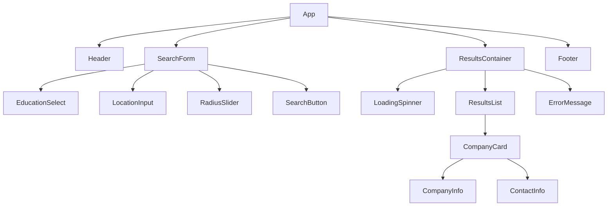
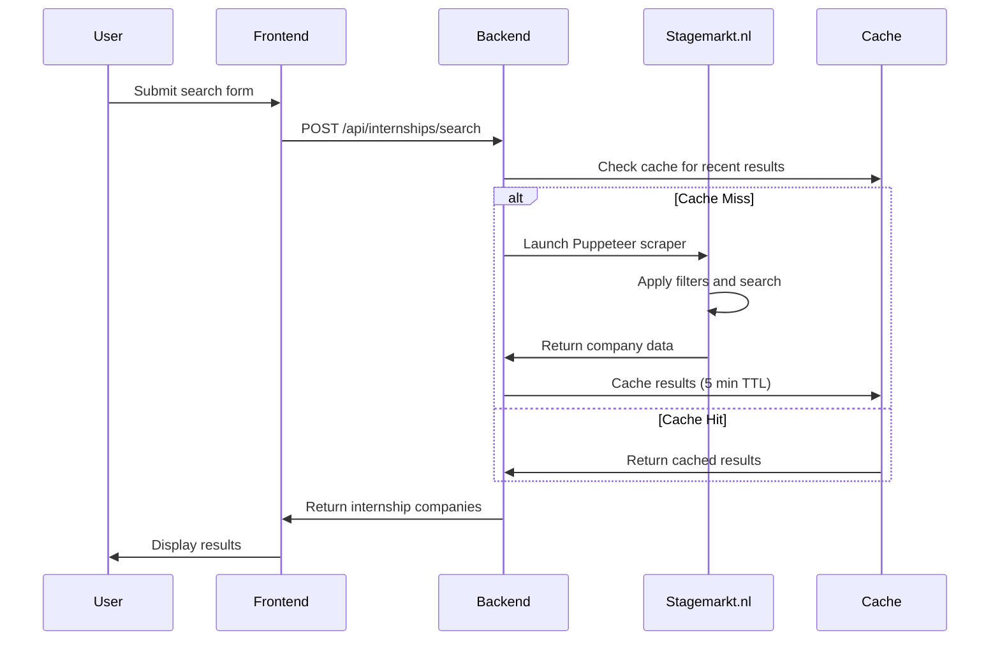

# Stage Job Finder Web Application Design

## Overview

The Stage Job Finder is a web application that helps level 2 students find internship positions by searching stagemarkt.nl based on specific education tracks, location, and distance criteria. The application automatically retrieves company information and contact details for up to 5 internship companies.

### Target Users
- Level 2 students seeking internships in agricultural and green sectors
- Educational institutions managing student internship placements

### Core Functionality
- Filter internships by education track and location
- Integrate with stagemarkt.nl for real-time data retrieval
- Present company and contact information in an organized format

## Technology Stack & Dependencies

### Frontend
- **Framework**: React 18+ with TypeScript
- **Styling**: Tailwind CSS for responsive design
- **State Management**: React Context API with useReducer
- **Form Handling**: React Hook Form with Zod validation
- **HTTP Client**: Axios for API communication
- **UI Components**: Custom components with accessibility features

### Backend
- **Runtime**: Node.js with Express.js
- **Language**: TypeScript
- **Web Scraping**: Puppeteer for stagemarkt.nl data extraction
- **Validation**: Zod for schema validation
- **Rate Limiting**: express-rate-limit for API protection
- **Logging**: Winston for structured logging

### Infrastructure
- **Database**: Not required (real-time data retrieval)
- **Caching**: Redis for temporary result caching
- **Deployment**: Docker containers with environment-based configuration

## Component Architecture

### Component Hierarchy



### Component Definitions

#### SearchForm Component
```typescript
interface SearchFormProps {
  onSearch: (criteria: SearchCriteria) => void;
  isLoading: boolean;
}

interface SearchCriteria {
  education: EducationTrack;
  location: string;
  radiusKm: number;
}
```

#### CompanyCard Component
```typescript
interface CompanyCardProps {
  company: InternshipCompany;
}

interface InternshipCompany {
  name: string;
  address: string;
  city: string;
  contact: ContactPerson;
}

interface ContactPerson {
  name: string;
  phone: string;
  email: string;
}
```

### State Management Strategy

```typescript
interface AppState {
  searchCriteria: SearchCriteria | null;
  results: InternshipCompany[];
  loading: boolean;
  error: string | null;
  searchHistory: SearchCriteria[];
}

type AppAction = 
  | { type: 'SEARCH_START'; payload: SearchCriteria }
  | { type: 'SEARCH_SUCCESS'; payload: InternshipCompany[] }
  | { type: 'SEARCH_ERROR'; payload: string }
  | { type: 'CLEAR_RESULTS' };
```

## API Integration Layer

### Backend API Endpoints

#### Search Internships Endpoint
```typescript
POST /api/internships/search
{
  "education": "Medewerker Hovenier",
  "location": "Amsterdam",
  "radiusKm": 25
}

Response:
{
  "success": true,
  "data": [
    {
      "name": "Groenbedrijf De Tuin",
      "address": "Hoofdstraat 123",
      "city": "Amsterdam",
      "contact": {
        "name": "Jan Jansen",
        "phone": "020-1234567",
        "email": "j.jansen@groenbedrijf.nl"
      }
    }
  ],
  "meta": {
    "totalFound": 3,
    "searchRadius": 25,
    "searchLocation": "Amsterdam"
  }
}
```

### Stagemarkt.nl Integration Service

```typescript
class StagemarktScraper {
  async searchInternships(criteria: SearchCriteria): Promise<InternshipCompany[]> {
    // Puppeteer implementation for data extraction
  }
  
  private async navigateToSearchPage(): Promise<void> {
    // Navigate to stagemarkt.nl search interface
  }
  
  private async applyFilters(criteria: SearchCriteria): Promise<void> {
    // Apply level 2, education track, location, and radius filters
  }
  
  private async extractCompanyData(): Promise<InternshipCompany[]> {
    // Extract company and contact information (max 5 results)
  }
}
```

## Business Logic Layer

### Search Flow Architecture



### Education Track Mapping

| Frontend Display | Stagemarkt.nl Filter Value |
|------------------|---------------------------|
| Medewerker Hovenier | "hovenier" |
| Medewerker Dierverzorging | "dierverzorging" |
| Medewerker Veehouderij | "veehouderij" |
| Medewerker Groen, grond en groene infra | "groen-infra" |
| Medewerker bloem, groen en styling | "bloem-styling" |

### Validation Rules

```typescript
const searchCriteriaSchema = z.object({
  education: z.enum([
    'Medewerker Hovenier',
    'Medewerker Dierverzorging', 
    'Medewerker Veehouderij',
    'Medewerker Groen, grond en groene infra',
    'Medewerker bloem, groen en styling'
  ]),
  location: z.string().min(2).max(100),
  radiusKm: z.number().min(5).max(100)
});
```

## User Interface Architecture

### Search Form Layout


### Responsive Design Breakpoints

- **Mobile**: 320px - 768px (single column layout)
- **Tablet**: 768px - 1024px (two column results)
- **Desktop**: 1024px+ (three column results with sidebar form)

### Accessibility Features

- ARIA labels for all form controls
- Keyboard navigation support
- Screen reader compatible result announcements
- High contrast mode support
- Focus management for dynamic content

## Error Handling & Edge Cases

### Frontend Error States

```typescript
interface ErrorState {
  type: 'network' | 'validation' | 'scraping' | 'rate_limit';
  message: string;
  retryable: boolean;
}
```

### Backend Error Responses

```typescript
// Rate limiting exceeded
{
  "success": false,
  "error": {
    "code": "RATE_LIMIT_EXCEEDED",
    "message": "Te veel zoekopdrachten. Probeer over 1 minuut opnieuw."
  }
}

// Stagemarkt.nl unavailable
{
  "success": false,
  "error": {
    "code": "SOURCE_UNAVAILABLE", 
    "message": "Stagemarkt.nl is tijdelijk niet beschikbaar."
  }
}
```

### Fallback Strategies

1. **Cache Fallback**: Return stale cached results if stagemarkt.nl is unavailable
2. **Partial Results**: Display available data even if some extraction fails
3. **Retry Logic**: Exponential backoff for transient failures
4. **Graceful Degradation**: Core functionality remains when advanced features fail

## Performance Optimization

### Caching Strategy

```typescript
interface CacheKey {
  education: string;
  location: string;
  radiusKm: number;
}

interface CacheEntry {
  results: InternshipCompany[];
  timestamp: number;
  expiresAt: number;
}
```

### Rate Limiting Configuration

- **Per IP**: 10 requests per minute
- **Per Session**: 5 concurrent searches
- **Global**: 100 requests per minute across all users

### Frontend Performance

- Debounced location input (300ms delay)
- Lazy loading for result images
- Virtual scrolling for large result sets
- Memoized component rendering

## Testing Strategy

### Unit Testing

```typescript
// Frontend component tests
describe('SearchForm', () => {
  it('validates education track selection', () => {
    // Test education track validation
  });
  
  it('handles location input correctly', () => {
    // Test location input and validation
  });
});

// Backend service tests  
describe('StagemarktScraper', () => {
  it('extracts company data correctly', () => {
    // Mock Puppeteer and test data extraction
  });
  
  it('handles search errors gracefully', () => {
    // Test error handling scenarios
  });
});
```

### Integration Testing

```typescript
describe('Search Integration', () => {
  it('completes full search flow', async () => {
    // Test end-to-end search functionality
  });
  
  it('handles stagemarkt.nl changes', async () => {
    // Test resilience to website structure changes
  });
});
```

### End-to-End Testing

- Automated browser testing with Playwright
- Search form interaction testing
- Result display verification
- Error state handling validation
- Performance regression testing

## Security Considerations

### Data Protection
- No personal data storage (real-time retrieval only)
- Secure HTTP headers implementation
- Input sanitization for all user inputs

### Rate Limiting & Abuse Prevention
- IP-based rate limiting
- CAPTCHA integration for suspicious activity
- Request signature validation

### Web Scraping Ethics
- Respect robots.txt guidelines
- Implement reasonable delays between requests
- User agent identification
- Monitor for blocking and adapt accordingly